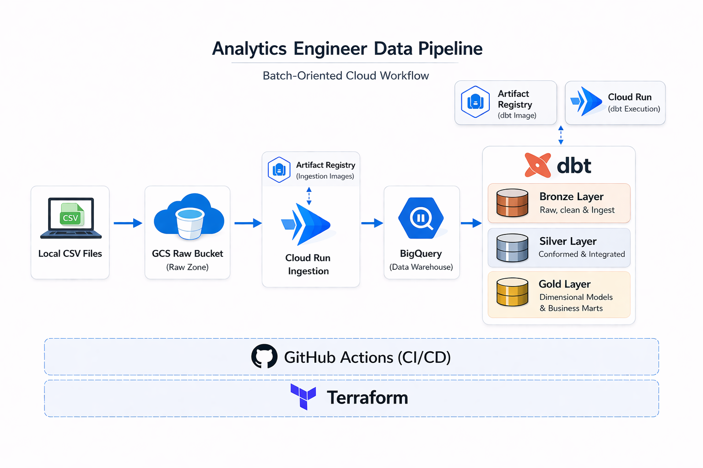

# E-commerce Analytics Engineering on GCP

This repository is an end-to-end analytics engineering project built on Google Cloud. It takes raw Brazilian e-commerce CSV files, validates and uploads them to GCS, loads them into append-only BigQuery `raw` tables, and transforms them with dbt into a dimensional reporting layer.

It is designed to show practical analytics engineering work across ingestion, modeling, testing, deployment, and infrastructure without adding unnecessary platform complexity.

## What This Repo Demonstrates

- Python-based raw file validation and upload
- Contract-driven ingestion into BigQuery
- dbt staging, intermediate, fact, dimension, and business mart models
- Terraform-managed GCP infrastructure
- GitHub Actions CI and deploy workflows using Workload Identity Federation
- A batch architecture that stays straightforward to operate

## Business Focus

The reporting layer is built to answer a small set of useful questions:

- How orders and revenue trend over time
- Which categories drive revenue and which correlate with weaker customer experience
- How delivery performance relates to review outcomes
- How customer segments differ in behavior and value

## Architecture



Flow:

1. Local CSV files in `data/raw/` are validated against [`schema_contracts.yaml`](cloud_run/ingestion/schema_contracts.yaml).
2. [`raw_upload/`](raw_upload/) uploads approved files to GCS with table-aligned object paths.
3. [`cloud_run/ingestion/`](cloud_run/ingestion/) loads each file into a temporary BigQuery table, then appends it to a partitioned `raw` table with ingestion metadata.
4. [`dbt/`](dbt/) builds `stg`, `int`, and `mart` datasets on top of the raw layer.
5. [`terraform/root/`](terraform/root/) provisions storage, datasets, service accounts, Artifact Registry, Cloud Run jobs, IAM, and GitHub OIDC/WIF integration.

## Data Model

The warehouse structure:

- `raw`: append-only landed data with ingestion metadata
- `stg`: cleaned and deduplicated source-aligned models
- `int`: reusable joins and business logic
- `mart`: final presentation layer split into dimensional core models and business marts

Inside `mart`, the project uses:

- dimensional core models: `dim_customers`, `dim_products`, `fct_orders`, `fct_order_items`
- business marts: `mart_kpi_daily`, `mart_category_performance`, `mart_delivery_satisfaction`, `mart_customer_segments`

More detail and lineage live in [dbt/README.md](dbt/README.md).

## Source Data

The project uses a subset of the Brazilian e-commerce dataset files stored in `data/raw/`.

Files currently in scope:

- `orders.csv`
- `order_items.csv`
- `reviews.csv`
- `customers.csv`
- `products.csv`
- `category_translation.csv`

## Tech Stack

- Python
- Google Cloud Storage
- BigQuery
- Cloud Run Jobs
- Artifact Registry
- dbt Core
- Terraform
- GitHub Actions

## Repo Guide

```text
data/raw/             Source CSV files used for the project
raw_upload/           Local validation and upload logic for GCS
cloud_run/ingestion/  BigQuery raw ingestion workload
cloud_run/dbt/        Cloud Run image for dbt execution
dbt/                  Transformation models, tests, macros, and docs
terraform/root/       GCP infrastructure and GitHub WIF setup
tests/                Python unit tests
runbook.md            Bootstrap, deploy, and execution steps
```

## Quick Start

Use [.env.example](.env.example) and [terraform.tfvars.example](terraform/root/terraform.tfvars.example) as templates.

For dbt, Terraform manages the base dataset names for `raw`, `stg`, `int`, and `mart`. Local development builds into user-suffixed schemas, while CI and Cloud Run use isolated CI schemas and fixed production schemas.

For local setup, infrastructure bootstrap, testing, raw file upload, and Cloud Run execution, follow [runbook.md](runbook.md).

The runbook covers the full end-to-end flow, including first-time infrastructure setup, image build and push, raw file upload, and job execution.

## CI/CD Pipeline

CI in [`.github/workflows/ci.yml`](.github/workflows/ci.yml) runs:

- Python unit tests
- `dbt deps`, `dbt parse`, and `dbt build`
- Terraform formatting checks
- ephemeral BigQuery datasets for isolated CI dbt validation

Deploy in [`.github/workflows/deploy.yml`](.github/workflows/deploy.yml) builds and pushes both Cloud Run images, then updates the ingestion and dbt jobs in GCP.

## Design Choices

- Raw ingestion is append-only by design.
- Schema validation happens before upload and schema enforcement happens again at load time.
- Deduplication is handled in dbt staging, not inside the ingestion job.
- Category review attribution is intentionally conservative and uses only orders with exactly one item and one review.
- Cloud Run image rollout is handled outside Terraform so normal code deploys do not require a full infra apply.
- Workload identities are separated across ingestion, dbt, CI, and deploy service accounts.
