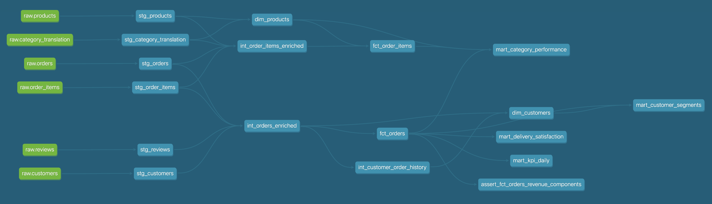

# dbt Layer

This folder contains the transformation layer of the project. It turns append-only BigQuery `raw` tables into cleaned staging models, reusable intermediate models, a dimensional core, and business-facing marts for dashboards.

The goal of this layer is to transform raw operational data into trusted analytical models that are easy to test, explain, and consume in reporting.

## Modeling Approach

- `stg`
  Cleaning, type normalization, and deduplication
- `int`
  Reusable business logic and enrichment
- `marts/core`
  Dimensional models with `dim_*` and `fct_*`
- `marts/business`
  Aggregated marts aligned to the business questions

## Core Models

- `dim_customers`
- `dim_products`
- `fct_orders`
- `fct_order_items`

## Key Grains

- `fct_orders`
  One row per `order_id`
- `fct_order_items`
  One row per `order_id`, `order_item_id`
- `mart_kpi_daily`
  One row per `order_purchase_date`
- `mart_category_performance`
  One row per `order_purchase_month_start`, `category_name`
- `mart_delivery_satisfaction`
  One row per `order_purchase_month_start`, `delivery_bucket`
- `mart_customer_segments`
  One row per `order_purchase_month_start`, `customer_segment`

## Lineage



## Design Notes

- `raw` is append-only; deduplication happens in staging
- reviews stay at review grain in `stg_reviews` and are aggregated to order level later
- category review metrics are restricted to orders with exactly one item and one review, which provides the highest-confidence review-to-category attribution available in this dataset

## Local Commands

Local commands assume the required environment variables are already available in the shell and that the committed [profiles.yml](profiles.yml) file is used as the local dbt profile.

```bash
dbt parse --project-dir dbt --profiles-dir dbt
dbt build --project-dir dbt --profiles-dir dbt
dbt docs generate --project-dir dbt --profiles-dir dbt
```
